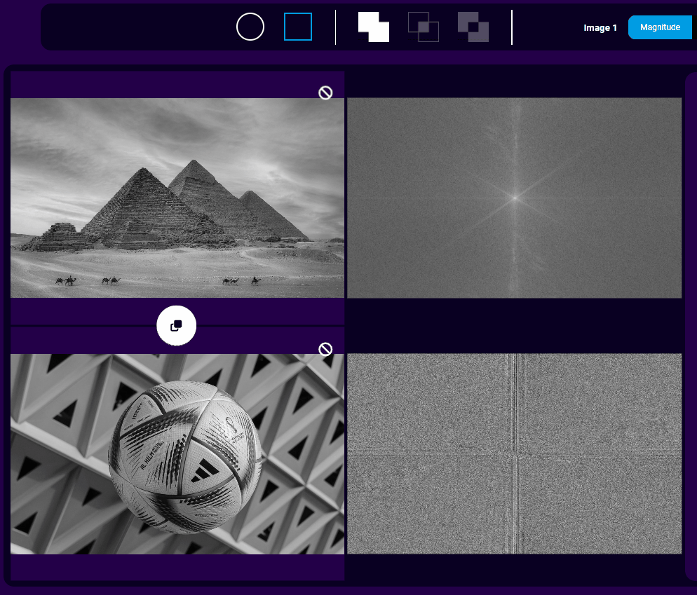
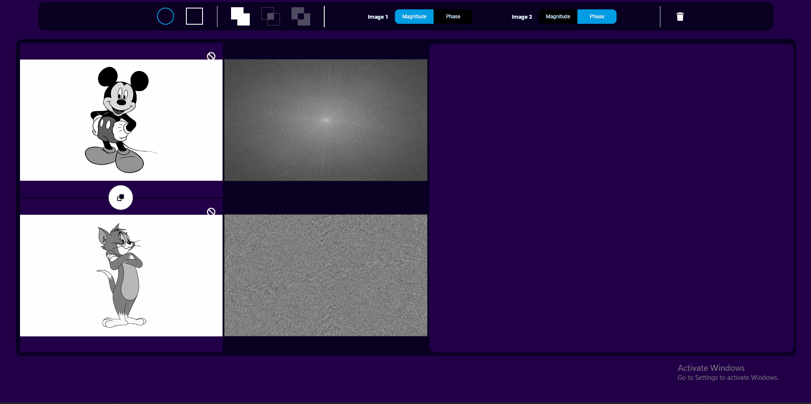
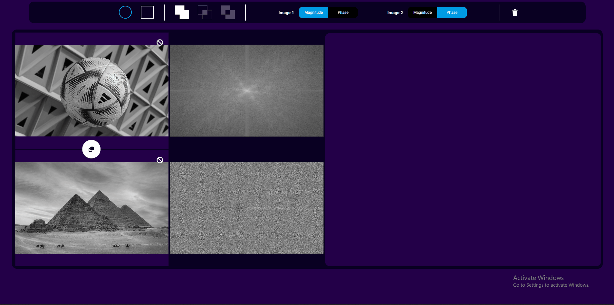

# Fourier Image Mixer || DSP Task 4

## Table of contents:

- [Introduction](#introduction)
- [Project Features](#project-features)
- [Project full Demo with examples](#project-full-demo-with-examples)
- [Project Structure](#project-structure)
- [How to Run The Project](#run-the-project)
- [Team]()

### Introduction

Fourier Image Mixer web application is used for testing the mixture of magnitude and phase of different images together and how the output be like.

### Project Features

In this web application you can

> 1. Upload 2 different images - Clone same image - choose uniform fourier
>    

> 2. Select which part to mix with 2 shapes and unlimited shapes number
>    

> 3. Select between different selection modes
>    

### Project full Demo with examples

1. All phase / All magnitude
   

2. Random selections
   

### Project Structure

The Web Application is built using:

- Frontend:
  - HTML
  - CSS
  - JavaScript
  - Ajax
- Backend framework:

  - Flask (Python)

- The Frontend main function to

  - set the structure of the page (main.js)
  - Drawing functionality with different modes(drawing.js)
  - send selections to back for mixing (mix.js)

- While Backend main function to
  - Fourier Transform for input images
  - Retrieve output image with inverse fourier

```
main
├─ Processing
│  ├─  image.py
│  ├─  mask.py
│  └─  editor.py
├─ static (JS & CSS files)
│  ├─  css
│  ├─  img
│  └─  js
│      ├─  main.js
│      ├─  mix.js
│      └─  drawing.js
├─ template (HTML files)
├─ app.py (Back-End Server)
└─ README.md
```

### Run the Project

1. Install [Python3](www.python.org/downloads/) in your computer

2. Install the packages

- Open Project Terminal & Run

```
pip install -r requirments.txt
```

3. Start Server by Running

```
python app.py
```

4. Visit http://127.0.0.1:5000

### Team

First Semester - Biomedical Digital Signal Processing (SBE3110) class project created by:

| Team Members' Names                                    | Section | B.N. |
| ------------------------------------------------------ | :-----: | :--: |
| [Abdelrahman Yasser](https://github.com/Abdelrhman012) |    1    |  52  |
| [Kamel Mohammed](https://github.com/KamelMoohamed)     |    2    |  10  |
| [Romaisaa Shrief](https://github.com/Romaisaa)         |    1    |  36  |
| [Youssef Shaaban](https://github.com/youssef-shaban)   |    2    |  56  |

### Submitted to:

- Dr. Tamer Basha & Eng. Abdullah Darwish
  All rights reserved © 2022 to Team 4 - Systems & Biomedical Engineering, Cairo University (Class 2024)
